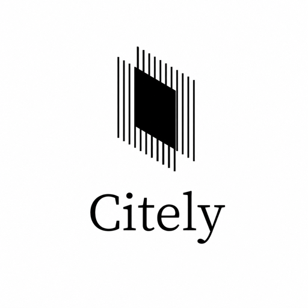
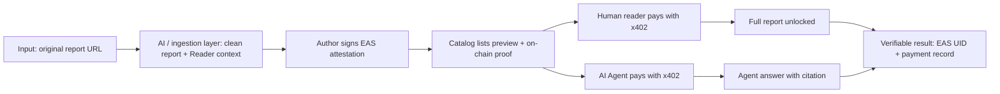
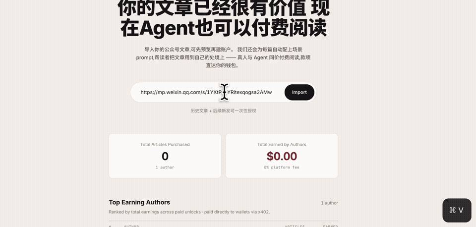

<a id="citely"></a>

<p align="center">
  
</p>

# Citely

> Experts publish Web3 legal, compliance, security, and risk reports with on-chain provenance. Human readers and AI agents unlock the same paid report through x402, with revenue sent directly to the author wallet.

[](https://nextjs.org/)
[](https://react.dev/)
[](https://x402.org/)
[](https://docs.base.org/)
[](https://attest.org/)
[](LICENSE)

[中文](README.md) | **English**

## Table of Contents

- [Project Overview](#project-overview)
- [Problem](#problem)
- [Why AI](#why-ai)
- [Why Web3](#why-web3)
- [How It Works](#how-it-works)
- [Demo](#demo)
- [Roadmap](#roadmap)
- [Validation](#validation)
- [Risks](#risks)
- [Team](#team)
- [License](#license)

## Project Overview

Citely is an on-chain content licensing and pay-per-read platform for expert Web3 compliance content. Lawyers, compliance advisors, security researchers, auditors, tax professionals, and domain analysts can publish risk reports as verifiable content; human readers and AI agents then pay the same x402 price to unlock the full text.

This submission is the **hackathon MVP** for the Citely platform. It freezes one required end-to-end flow:

```text
input report URL -> clean report + Citely Reader context -> author signs on-chain -> human/agent pays -> verifiable result
```

The current MVP runs on Base Sepolia, uses EAS for author/content/price attestations, x402 for USDC pay-per-read access, and Cobo Agentic Wallet / pact to demonstrate constrained agent payments.

## Problem

High-quality Web3 risk analysis often lives in long-form posts, legal notes, research memos, WeChat articles, Mirror posts, Substack essays, or law-firm content. These materials are hard for humans and AI agents to reuse in a way that is trusted, payable, and traceable.

- **Provenance is weak**: readers cannot easily verify the author, content version, price, or whether the content was modified.
- **Agents lack a native legal content payment path**: subscriptions, API keys, and platform accounts do not fit small, on-demand agent reads.
- **Authors do not get paid when agents read them**: AI tools can consume expert content to answer users, but authors rarely receive direct compensation.
- **Platform custody adds trust cost**: platform cuts, delayed settlement, and opaque accounting reduce author willingness to participate.

## Why AI

Citely does not replace experts with AI. It makes expert content safely consumable by AI agents.

- AI agents can discover relevant reports for a user question instead of forcing users to browse the entire catalog.
- After payment, Citely Reader receives the full report plus structured reading context such as glossary, legal map, and misconception table.
- Agent output should cite the author and on-chain attestation, avoiding uncited legal or compliance claims.
- In this MVP, the **Citely Reader payment and response flow is real**; Reader context is pre-baked, while live LLM generation of reading context is a next step.

## Why Web3

Web3 is the provenance and settlement layer, not decoration.

- **EAS attestation** records author, content hash, price, version, and disclaimer in a reviewable record.
- **x402 pay-per-read** gives humans and agents the same HTTP 402 payment path without API keys.
- **Dynamic payTo** routes each report payment to the corresponding author wallet instead of a platform custody account.
- **Cobo pact / Agentic Wallet** constrains agent payments by policy, such as amount, recipient, chain, and asset.

## How It Works



### MVP Scope Freeze

| Priority | Included |
|---|---|
| **Must-have** | One report lifecycle; `/publish`; EAS attestation; `/reports`; x402 paid article endpoint; agent reader flow; one validation trail. |
| **Should-have** | Human wallet unlock; Citely Reader response; visible author earned counter; `README` and 3-5 minute demo story. |
| **Nice-to-have** | More reports; polished `/how-it-works`; author leaderboard polish; downloaded article package after payment. |
| **Cut / Mock** | Production DB/KV persistence; full author dashboard; mainnet settlement; live LLM generation of Reader context; fully automated URL ingestion for every source. |

## Demo

The demo focuses on one main flow: **input report URL -> AI / agent processing -> author signs on-chain -> human and agent pay to read -> verifiable result**.

### Video Demo



**Full demo video**: [YouTube](https://www.youtube.com/watch?v=C0cxGBRsE68)

### Main Flow

| Step | What Happens | Status |
|---|---|---|
| 1. Author input | The author enters an original report URL in For Writers and opens `/publish`. | Shown in demo |
| 2. AI / agent processing | The system turns the source into an in-app report and structured context that Citely Reader can use. | Reader context is pre-baked |
| 3. Web3 provenance | The author signs with a wallet, creates an EAS attestation, and the report appears in the catalog with an on-chain badge. | Base Sepolia testnet |
| 4. Human payment | A human reader pays test USDC through x402 with MetaMask and unlocks the full report. | Shown in demo |
| 5. Agent payment | Citely Reader calls the paid API, follows `402 -> pay -> 200`, receives the full report plus structured context, and answers with citation. | Shown in demo |
| 6. Verifiable result | The result can be checked through EAS UID, testnet transaction/payment logs, API response, or demo video. | Explorer links to be confirmed |

## Roadmap

| Stage | Direction |
|---|---|
| Current MVP | Prove one end-to-end flow for expert content: import, attestation, x402 payment, human / agent unlock, and verifiable result. |
| Next Stage | Add an author allowlist and content review process, focusing first on high-quality compliance, risk, security, and research content. |
| Platform Stage | Expand the multi-author content library, production data storage, cross-device purchase records, author revenue dashboard, and agent discovery entry points. |
| Long Term | Become a trusted professional knowledge layer for AI agents, where provenance, authorization, payment, and citation are verifiable. |

## Validation

| Evidence | Current Status | Notes |
|---|---|---|
| EAS attestation UID | Local index contains records | `yaoqian-crypto-liability`: `0xe084046a63beff82e07a768907c8802ce9dc3954c74334e6d3046446fb10cfec`; `web3-illegal-employment`: `0x16669c5a17d62f52529971e24151e8d91220318f9ecc29ff087b2f57f449f7f6`. Explorer links should be confirmed before final submission. |
| EAS transaction hash | Local index contains records | `0xd90b24a6c264c9359dc8ebd1d1ee48a6d8f5003b635ca465492147d149e03b42`; `0x20fc5d67096155adfe1b44ef2f88928991f63a212182925a109ee02becc4b322`. |
| x402 paid API | Implemented | `GET /api/v1/articles/{slug}` returns 402 first, then 200 with full content + Reader context + citation after payment. |
| Agent discovery | Implemented | `public/SKILL.md`, `public/llms.txt`, `public/openapi.json`. |
| Local payment log | Demo records exist | `data/payment-log.json` records demo payment events; production should move this to DB/KV. |
| Tests | Reproducible | `pnpm test` / `pnpm build` can be used as final submission checks; final result to be added. |

## Risks

- **Testnet boundary**: the current demo runs on Base Sepolia and should not be treated as a mainnet payment flow.
- **Mock boundary**: Reader context is pre-baked; live LLM generation, author review workflow, and universal URL ingestion remain unfinished.
- **Persistence boundary**: the demo uses JSON files for the attestation index and payment log; Vercel serverless file writes are not production-safe.
- **Permission boundary**: agent payments must be constrained by wallet policy, never by raw private keys, unlimited approvals, or unbounded payment authority.
- **Content boundary**: Citely provides risk education, provenance, and paid access infrastructure, not legal advice.
- **Privacy and security**: never commit `.env.local`, private keys, seed phrases, CDP secrets, real-funds account data, or unencrypted paid article bodies.

## Team

| Member | Role | GitHub |
|---|---|---|
| Sophie | Former Web3 wallet product manager; product design and full-stack development | [@web3yaso](https://github.com/web3yaso) |
| Alex Fan | Cross-border compliance architect; compliance strategy and project narrative | [@alexfanzong](https://github.com/alexfanzong) |

## License

This project is open-sourced under the [Apache License 2.0](LICENSE).
