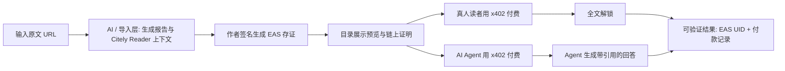

<a id="citely"></a>

<p align="center">
  
</p>

# Citely

> 专家把 Web3 法律、合规、安全与风险报告签名上链；真人读者和 AI Agent 用 x402 按篇付费解锁全文，收入 100% 直达作者钱包。

[](https://nextjs.org/)
[](https://react.dev/)
[](https://x402.org/)
[](https://docs.base.org/)
[](https://attest.org/)
[](LICENSE)

**中文** | [English](README.en.md)

## 目录

- [项目概览](#项目概览)
- [问题](#问题)
- [为什么需要 AI](#为什么需要-ai)
- [为什么需要 Web3](#为什么需要-web3)
- [主流程](#主流程)
- [演示](#演示)
- [路线图](#路线图)
- [验证材料](#验证材料)
- [风险边界](#风险边界)
- [团队](#团队)
- [许可](#许可)

## 项目概览

Citely 是一个面向专业 Web3 合规内容的链上内容授权与付费阅读平台。律师、合规顾问、安全研究员、审计师、税务师或行业分析师可以把风险报告发布为可验证内容；真人读者和 AI Agent 按同一价格通过 x402 付费解锁全文。

本次提交是 Citely 平台的 **hackathon MVP**，目标只冻结一条必须跑通的主流程：

```text
输入文章 URL -> 生成可读报告与 Citely Reader 上下文 -> 作者签名上链 -> 真人/Agent 付费读取 -> 返回可验证结果
```

当前 MVP 运行在 Base Sepolia 测试网，使用 EAS 做作者/内容/价格存证，使用 x402 做按篇 USDC 付费，使用 Cobo Agentic Wallet / pact 展示 Agent 支付边界。

## 问题

高质量 Web3 风险分析通常沉淀在公众号、Mirror、Substack、律所文章或研究员长文里，但它们很难被真人和 AI Agent 以可信、可结算、可追溯的方式复用。

- **出处难验证**：读者很难确认作者、版本、价格和内容是否被篡改。
- **Agent 难以合法付费读取**：传统订阅、API key 和平台账号不适合小额、临时、按需的 Agent 调用。
- **作者无法从 Agent 阅读中获得对价**：AI 工具可以“读”专家内容回答用户，但作者通常没有新的结算路径。
- **平台托管增加信任成本**：平台抽成、延迟结算和对账争议会削弱作者冷启动意愿。

## 为什么需要 AI

Citely 的核心不是让 AI 取代专家，而是让专家内容变成 Agent 可以安全消费的知识单元。

- AI Agent 可以根据用户问题发现相关报告，而不是让用户自己翻完整内容库。
- Agent 付费后由 Citely Reader 拿到全文和结构化阅读上下文，用术语表、法条地图、误区表辅助生成有边界的回答。
- Agent 输出必须带作者和链上存证引用，避免无来源的法律/合规判断。
- 本次 MVP 中，**Citely Reader 的付费读取与回答生成是真实主流程**；Citely Reader 上下文为预烘材料，实时 LLM 生成阅读上下文属于下一步。

## 为什么需要 Web3

Web3 不是装饰层，而是 Citely 的可信结算和可验证来源层。

- **EAS attestation**：把作者、内容哈希、价格、版本和免责声明写成可复查记录。
- **x402 pay-per-read**：真人和 Agent 走同一个 HTTP 402 付费路径，价格一致，无需 API key。
- **动态 payTo**：每篇报告的收款地址指向对应作者钱包，平台不托管内容侧资金。
- **Cobo pact / Agentic Wallet**：Agent 付款必须受授权边界约束，例如金额、收款方、链和资产。

## 主流程



### MVP 范围冻结

| 优先级 | 本次包含 |
|---|---|
| **必做** | 单篇报告生命周期；`/publish`；EAS 存证；`/reports`；x402 付费文章接口；Agent reader 主流程；至少一条可复查验证链路。 |
| **应做** | 真人钱包解锁；Citely Reader 回答；作者收益可见；`README` 与 3-5 分钟演示。 |
| **加分** | 更多报告；完善 `/how-it-works`；作者榜单打磨；付费后文章包下载。 |
| **暂缓** | 生产 DB/KV 持久化；完整作者后台；主网结算；实时 LLM 生成 Citely Reader 上下文；所有来源的全自动 URL 导入。 |

## 演示

Demo 只展示一条主流程：**输入文章 URL -> AI / agent 处理 -> 作者签名上链 -> 真人和 Agent 付费读取 -> 返回可验证结果**。

### 视频演示


**完整 Demo 视频**：[YouTube](https://www.youtube.com/watch?v=C0cxGBRsE68)

### 主流程说明

| 步骤 | 发生什么 | 状态 |
|---|---|---|
| 1. 作者输入 | 作者在 For Writers 输入原文 URL，进入 `/publish`。 | 演示中可见 |
| 2. AI / Agent 处理 | 系统把文章整理为站内报告和 Citely Reader 可用的结构化上下文。 | Citely Reader 上下文为预烘材料 |
| 3. Web3 来源存证 | 作者钱包签名，生成 EAS attestation，报告进入目录并显示链上徽章。 | Base Sepolia 测试网 |
| 4. 真人付费 | 真人读者用 MetaMask 通过 x402 支付测试 USDC，解锁全文。 | 演示中可见 |
| 5. Agent 付费 | Citely Reader 调用付费 API，经历 `402 -> pay -> 200`，拿到全文和结构化上下文，并输出带引用的回答。 | 演示中可见 |
| 6. 可验证结果 | 可复查 EAS UID、测试网交易/付款日志、API 响应或 demo 视频。 | Explorer 链接待最终确认 |

## 路线图

| 阶段 | 方向 |
|---|---|
| 当前 MVP | 跑通单篇专业内容的完整闭环：导入、签名存证、x402 付费、真人 / Agent 解锁与可验证结果。 |
| 下一阶段 | 建立作者白名单与内容审核机制，优先引入高质量合规、风控、安全与研究类内容。 |
| 平台化阶段 | 完善多作者内容库、生产级数据存储、跨设备购买记录、作者收益看板与 Agent 发现入口。 |
| 长期方向 | 扩展为面向 AI Agent 的可信专业知识层，让来源、授权、付款和引用都可以被验证。 |

## 验证材料

| 证据 | 当前状态 | 说明 |
|---|---|---|
| EAS attestation UID | 已有本地索引记录 | `yaoqian-crypto-liability`: `0xe084046a63beff82e07a768907c8802ce9dc3954c74334e6d3046446fb10cfec`; `web3-illegal-employment`: `0x16669c5a17d62f52529971e24151e8d91220318f9ecc29ff087b2f57f449f7f6`。最终提交前需确认 explorer 链接。 |
| EAS 交易哈希 | 已有本地索引记录 | `0xd90b24a6c264c9359dc8ebd1d1ee48a6d8f5003b635ca465492147d149e03b42`; `0x20fc5d67096155adfe1b44ef2f88928991f63a212182925a109ee02becc4b322`。 |
| x402 付费 API | 已实现 | `GET /api/v1/articles/{slug}`：首次 402，付款后 200 返回全文 + Citely Reader 上下文 + citation。 |
| Agent 发现入口 | 已实现 | `public/SKILL.md`、`public/llms.txt`、`public/openapi.json`。 |
| 本地付款日志 | 已有 demo 记录 | `data/payment-log.json` 记录 demo 付款事件；生产环境需迁移到 DB/KV。 |
| 测试与构建 | 可复查 | `pnpm test` / `pnpm build` 可作为最终提交前验证命令；最终结果待补。 |

## 风险边界

- **测试网边界**：当前跑在 Base Sepolia，不代表主网资金流已经上线。
- **Mock 边界**：Citely Reader 上下文为预烘内容；实时 LLM 生成、作者审核工作流和通用 URL 抓取仍未完成。
- **持久化边界**：当前 demo 用 JSON 文件记录 attestation index 和 payment log；Vercel serverless 上不适合持久写入。
- **权限边界**：Agent 支付必须受钱包策略限制，不能给主网私钥、无限授权或不受限支付能力。
- **内容边界**：Citely 提供风险教育、来源验证和付费访问基础设施，不提供法律意见。
- **隐私与安全**：公开 repo 不应提交 `.env.local`、私钥、助记词、CDP secret、真实资金账户信息或未加密的付费正文。

## 团队

| 成员 | 角色 | GitHub |
|---|---|---|
| Sophie | 前 Web3 钱包产品经理，负责产品设计与全栈开发 | [@web3yaso](https://github.com/web3yaso) |
| Alex Fan | 跨境合规架构师，负责合规策略与项目叙事 | [@alexfanzong](https://github.com/alexfanzong) |

## 许可

本项目采用 [Apache License 2.0](LICENSE) 开源。
